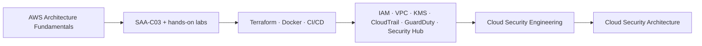

  
  
  

> *“A strong mind does not defend its first model of reality; it keeps testing, refining, and rebuilding until the evidence survives the story.”*

---

## 👨‍💻 About Me

- 🎓 Engineering cycle in **Cybersecurity & Cloud Computing**
- ☁️ Direction: **Cloud Security Engineering → Cloud Security Architecture**
- 🛡️ Strong interest in **SOC, SIEM, Detection Engineering, Network Security, IAM, DevSecOps and Security Automation**
- 🧠 I like systems that are **observable, reproducible, explainable and useful to an analyst**
- 🔬 My projects usually connect **telemetry → detection → enrichment → correlation → investigation → response**

---

## ⚡ Selected Security Work

<table>
<tr>
<td width="50%" valign="top">

### 🔎 SOC Graph AI
Built during my NearSecure internship: a laboratory SOC connecting **Wazuh → Python/MITRE enrichment → UEBA/ML → Neo4j → Streamlit → n8n/Shuffle**.

**Validated final dataset:** 1,396 alerts  
**Validation:** manual attack scenarios · Atomic Red Team · Caldera · Windows/Linux/pfSense telemetry

[Repository](https://github.com/Fadi-AICH/soc-graph-ai-security-lab) · [Case Study](https://fadi-aich.github.io/projects/soc-graph-ai/)

</td>
<td width="50%" valign="top">

### 🌐 Network Security Monitoring
Built during my Tanger Med internship: passive monitoring with **Cisco SPAN/RSPAN + SELKS + Suricata + Zeek + Elasticsearch/Kibana + Scirius**.

Focus: traffic visibility, IDS detection, behavioral telemetry, centralized investigation and rule governance.

[Repository](https://github.com/Fadi-AICH/tanger-med-network-security-monitoring) · [Case Study](https://fadi-aich.github.io/projects/tanger-med-nsm/)

</td>
</tr>
<tr>
<td width="50%" valign="top">

### 🧠 CyberGuard MLOps
End-to-end IoT intrusion-detection platform with reproducible ML workflows, API serving, observability, orchestration and a SOC-style analyst interface.

**Selected model:** Gradient Boosting · **F1: 0.941** on the project sample.

[Repository](https://github.com/Fadi-AICH/cyberguard-mlops) · [Case Study](https://fadi-aich.github.io/projects/cyberguard-mlops/)

</td>
<td width="50%" valign="top">

### 🔐 Secure Transmission Protocol Simulator
Desktop security-engineering simulator combining **AES-CBC, Hamming(7,4), CRC, noisy-channel simulation and ACK/NACK retransmission** with automated tests.

[Repository](https://github.com/Fadi-AICH/Secure-Transmission-Protocol-Simulator) · [Case Study](https://fadi-aich.github.io/projects/secure-transmission-protocol/)

</td>
</tr>
</table>

---

## 🧰 Technical Stack

### 🛡️ Detection, SOC & Network Security

### ⚔️ Adversary Emulation, Automation & SOAR

### ☁️ Cloud & DevSecOps

### 📈 MLOps, Data & Observability

### 💻 Programming, Systems & Application Engineering

---

## 🧪 Other Labs

- [Detection Engineering Lab](https://github.com/Fadi-AICH/detection-engineering-lab) — Sigma, Wazuh and Suricata detection experiments mapped to MITRE ATT&CK.
- [AI Security Lab](https://github.com/Fadi-AICH/ai-security-lab) — prompt-injection evaluation, coding-agent security and static checks for risky AI-generated Python patterns.

---

## ☁️ Current Learning Path

---

## 📊 GitHub Pulse

<picture>
  <source media="(prefers-color-scheme: dark)" srcset="https://raw.githubusercontent.com/Fadi-AICH/Fadi-AICH/output/github-contribution-grid-snake-dark.svg" />
  <source media="(prefers-color-scheme: light)" srcset="https://raw.githubusercontent.com/Fadi-AICH/Fadi-AICH/output/github-contribution-grid-snake.svg" />
  
</picture>

---

### Explore more

[**Portfolio**](https://fadi-aich.github.io/) · [**Projects**](https://fadi-aich.github.io/projects/) · [**GitHub**](https://github.com/Fadi-AICH) · [**TryHackMe**](https://tryhackme.com/p/FadiX)

`Cybersecurity` · `Cloud Security` · `Detection Engineering` · `DevSecOps` · `Security Automation`

